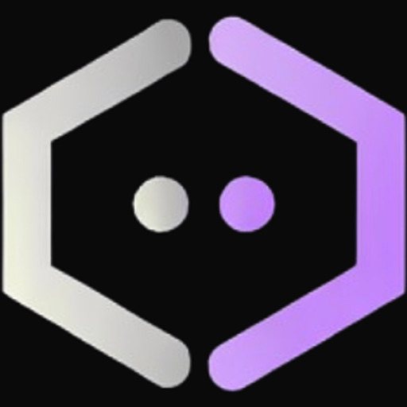

<p align="center">
  
</p>

<p align="center">
  
</p>

<p align="center">
  <strong>AI-native development environment</strong> — Mission control for parallel AI agents.
</p>

Codrox is an Electron desktop app that replaces the traditional IDE paradigm. Instead of writing code yourself, you direct Claude Code agents working in isolated git worktrees, each moving through a structured feature lifecycle. Propose → Grill → Research → Plan → Implement → Verify.

**Current version:** 0.1.18  
**License:** MIT

## What is this?

Codrox flips the development model on its head. Rather than you being the keyboard, you become the orchestrator:

- **Delegate, don't code** — Direct multiple Claude Code agents in parallel, each with its own git worktree and feature branch.
- **Structured lifecycle** — Every agent follows the same six-phase workflow: propose, grill assumptions, research, plan, implement, verify.
- **Mission control** — Monitor workspace state, worktree status, file changes, terminal output, and agent progress all in one UI.
- **Integrated environment** — Terminal, code editor, browser, git changes, and Claude Code CLI all within one pane-based layout.

## Highlights

### Workspaces & Worktrees
Point Codrox at any git repo and it becomes your workspace. Inside each workspace, spin up isolated **git worktrees** — one per feature, bug fix, or experiment. Each worktree gets its own branch, its own Claude session, and its own lifecycle state. Run them all in parallel.

### Linear Integration
Connect your Linear account and drag tasks straight from the sidebar onto a worktree. Codrox auto-creates the branch from the Linear issue, links the worktree to the task, and keeps everything in sync. Your issue tracker and your dev environment in one place.

### Built-in Browser
Full Chromium webview with DevTools built into the layout. Preview your localhost, inspect elements, debug network requests — without leaving the app. Opens as a tab alongside your terminal, editor, and Claude sessions.

### Structured Agent Lifecycle
Every feature moves through six phases: **Propose → Grill → Research → Plan → Implement → Verify**. Each phase sets Claude to a different mode — adversarial review during Grill, investigative during Research, autonomous execution during Implement. No more freeform prompting.

## All Features

- **Workspace Management** — Create, switch, and manage multiple workspaces with SQLite persistence.
- **Worktree Parallelism** — Multiple isolated git worktrees per workspace, each with its own branch and Claude session.
- **Linear Drag & Drop** — Drag Linear issues onto worktrees to auto-create branches and link tasks.
- **Inline Browser** — Chromium webview with Chrome DevTools for previewing and debugging without leaving the app.
- **Claude Tabs** — Launch Claude Code CLI agents directly via PTY for real-time AI collaboration.
- **Terminal Tabs** — Full xterm.js + node-pty terminal with multiple sessions.
- **Editor Tabs** — CodeMirror 6 with syntax highlighting (JS/TS/Python/Rust/JSON/HTML/CSS/Markdown) and markdown preview.
- **Tmux-like Panes** — Split panes horizontally/vertically, resize, close, and nest for flexible layouts.
- **Tab System** — Multi-tab with drag-and-drop reordering and smart context switching.
- **File Tree & Git Changes** — Project structure with git status indicators and change tracking.
- **Agent Store** — Manage multiple agents with Greek letter naming (α–π).
- **Session Persistence** — Workspace state, open tabs, and layout persist across app restarts.

<!-- Screenshots coming soon -->

## Tech Stack

- **Electron** + **electron-vite** — Desktop app framework and build tool
- **React 19** — UI framework
- **TypeScript** — Type-safe code
- **CodeMirror 6** — Code editor
- **xterm.js** — Terminal emulation
- **node-pty** — PTY/terminal spawning
- **SQLite** (better-sqlite3) — Local persistence
- **Zustand** — Lightweight state management
- **simple-git** — Git operations (worktree, branch, diff, etc.)
- **@parcel/watcher** — File system monitoring

## Getting Started

1. **Download** the latest release from [GitHub Releases](https://github.com/vdzhyranov/codrox-app/releases).
2. **Install** — Open the `.dmg` (macOS) or `.AppImage` / `.deb` (Linux).
3. **Launch Codrox** and add a workspace by pointing it at a git repository.
4. **Create a worktree**, pick a branch, and start directing agents through the lifecycle.

### Requirements

- **Claude Code CLI** — Codrox uses Claude Code under the hood. Install it and sign in before launching. See [claude.ai/code](https://claude.ai/code) for details.
- **git** 2.27+ (for worktree support)

### Building from Source

```bash
git clone https://github.com/vdzhyranov/codrox-app.git
cd codrox-app
npm install
npm run dev          # development with hot reload
npm run build:mac    # macOS build
npm run build:linux  # Linux build
```

Requires Node.js 22+.

## Contributing

We welcome contributions! See [CONTRIBUTING.md](./CONTRIBUTING.md) for guidelines on:
- Setting up a dev environment
- Submitting issues and feature requests
- Creating pull requests
- Code style and testing expectations

## License

MIT. See [LICENSE](./LICENSE) for details.

---

**Author:** [@vdzhyranov](https://github.com/vdzhyranov)  
**Issues & Feedback:** [GitHub Issues](https://github.com/vdzhyranov/codrox-app/issues)
